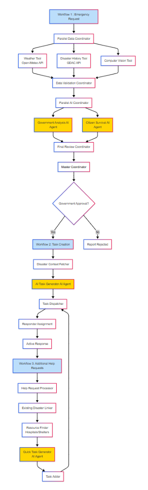

# Beminithiya

Beminithiya is a disaster management application with a React frontend, FastAPI backend, Appwrite integration, third-party API & MCP Server support.

---

## Project Setup

### Clone the Repository

```bash
git clone https://github.com/Adhishtanaka/Beminithiya.git
cd Beminithiya
```

---

## Frontend Setup

### Install and Run Frontend

```bash
cd frontend
bun install
bun run dev
```

> The frontend will run at: [http://localhost:5173](http://localhost:5173)

### Frontend Environment Configuration

Create a `.env` file in the `frontend/` directory with the following variables:

```
VITE_APPWRITE_ENDPOINT=your_appwrite_endpoint
VITE_APPWRITE_PROJECT_ID=your_appwrite_project_id
VITE_APPWRITE_DATABASE_ID=your_appwrite_database_id
VITE_APPWRITE_USERS_COLLECTION_ID=your_users_collection_id
VITE_APPWRITE_DISASTERS_COLLECTION_ID=your_disasters_collection_id
VITE_APPWRITE_AI_MATRIX_COLLECTION_ID=your_ai_matrix_collection_id
VITE_APPWRITE_TASKS_COLLECTION_ID=your_tasks_collection_id
VITE_APPWRITE_USER_REQUESTS_COLLECTION_ID=your_user_requests_collection_id
VITE_APPWRITE_RESOURCES_COLLECTION_ID=your_resources_collection_id
VITE_OPENWEATHER_API_KEY=your_openweather_api_key
```

### Trusted Email Domains

For domain verification of roles like government officials and first responders, update `trusted_domain.yaml` in the `backend/` directory:

```yaml
gov:
  - gov.example.com
  - ministry.gov
first_responders:
  - firedept.org
  - ambulance.org
  - police.org
```

This ensures that only users with approved domains can register as `gov` or `first_responders`. Volunteers and regular users are not domain-restricted.

---

## Backend Setup

### Install and Run Backend

```bash
cd backend

# Create a virtual environment (only first time)
python -m venv .venv

# Activate virtual environment
# On Windows:
.venv\Scripts\activate
# On macOS/Linux:
source .venv/bin/activate

# Install dependencies
uv pip install -r requirements.txt

# Run FastAPI backend
fastapi dev main.py
```

> The backend will run at: [http://localhost:8000](http://localhost:8000)

### Backend Environment Configuration

Create a `.env` file in the `backend/` directory with the following variables:

```
JWT_SECRET_KEY=your_jwt_secret_key
GOOGLE_API_KEY=your_gemini_api_key
APPWRITE_ENDPOINT=your_appwrite_endpoint
APPWRITE_PROJECT_ID=your_appwrite_project_id
APPWRITE_API_KEY=your_appwrite_api_key
APPWRITE_DATABASE_ID=your_appwrite_database_id
APPWRITE_BUCKET_ID=your_appwrite_bucket_id
APPWRITE_USERS_COLLECTION_ID=your_users_collection_id
APPWRITE_DISASTERS_COLLECTION_ID=your_disasters_collection_id
APPWRITE_AI_MATRIX_COLLECTION_ID=your_ai_matrix_collection_id
APPWRITE_TASKS_COLLECTION_ID=your_tasks_collection_id
APPWRITE_USER_REQUESTS_COLLECTION_ID=your_user_requests_collection_id
APPWRITE_RESOURCES_COLLECTION_ID=your_resources_collection_id
```

## MCP Server 

This MCP server provides location-aware disaster response capabilities. This server connects to a disaster management API to help users find nearby emergencies and report assistance needs. **No authentication or token setup is required.**

### Tools Available

- `get_nearby_disasters()` - Find disasters near your current location

### Installation & Usage

### 1. Clone the Repository
```bash
cd MCP Server

# Create a virtual environment (only first time)
python -m venv .venv

# Activate virtual environment
# On Windows:
.venv\Scripts\activate
# On macOS/Linux:
source .venv/bin/activate

# Install dependencies
uv pip install -r requirements.txt
```

### 2. Run the MCP Server
```bash
mcp install server.py
```

## Telegram Bot

Beminithiya includes a Telegram bot that allows users to:
- Find disasters near a specified address
- Share their location to find nearby emergencies
- Get quick access to disaster information via Telegram

The bot integrates with the disaster management API and provides user-friendly commands and responses.

For setup instructions and more details, see the [Telegram Bot README](telegramBot/README.md).


## AI Models (.output_models Folder)

The model files used to train and run models for disaster detection and people counting are located in `Backend/.output_models/`:

* `cnn_model.pth`: Pre-trained PyTorch model for disaster classification and crowd estimation.
* `yolo.pt`: YOLO model weights for object detection.

## Assumptions 

* **Email Domain Trust**: In our role-based auth, certain roles (e.g. government officials and first responders) must use email domains listed in `trusted_domain.yaml` to signup. Example:

```yaml
gov:
  - gov.example.com
  - ministry.gov
first_responders:
  - firedept.org
  - ambulance.org
  - police.org
```

Volunteers and general users are not restricted by domain. Each government agency or first responder department must issue an official email to its personnel.

* **Disaster Location Precision & Reporter Proximity**: We assume each disaster affects around 20 km², based on geohash level 4. The first person requesting help is considered to be near the center of the affected area, not at the edge. This helps us quickly map the zone, prioritize response, and allocate resources. The area size can still be adjusted manually if needed.

* **Disaster Task Sending Strategy**:

  * **Small urgency** can be managed by volunteers.
  * **Medium-scale urgency** are handled primarily by first responders.
  * **Large-scale complex urgency** require combined efforts of government bodies and volunteers.
  * This structure ensures volunteer safety while enabling scalable response.

* **Resource Assumption**: All aid resources (e.g., shelters, medication stations) are assumed to be **static** and not mobile.

* **Voice Input**: Voice input is not accepted for reporting disasters due to:
  * **Environmental noise** commonly present in disaster situations can interfere with voice recognition accuracy.
  * **Language or accent barriers** may prevent accurate interpretation of spoken reports.
  * Individuals may be in **distress or panic**, which can affect speech clarity and coherence.

* **Image Analysis Strategy**:

  * We **do not** use VLMs like CLIP for classification due to high computational cost and low control over label specificity.
  * Instead, a **custom CNN model** is used to classify disaster types and count people—this is faster and cheaper after training.
  * Additionally, we leverage **Gemini Flash 2 API**, a multimodal model, which is also a VLM capable model for more robust image understanding.

* **Weather Data**:

  * We use the **OpenWeather API** for map precipitation data filter relevant to disasters.
  * Although the API allows only **60 calls per minute**, this is considered acceptable under expected usage.

---

## AI Workflow Architecture

<p align="center">
  
</p>

### Workflow 1: Multiagent Emergency Report Analysis
**Triggered**: When first emergency call/photo is submitted
**Purpose**: Create government and citizen reports, predict future impact, validate request authenticity

**2 AI Agents:**

- **Government Analysis AI Agent**: Creates official response reports using Gemini AI
- **Citizen Survival AI Agent**: Generates public safety instructions using Gemini AI

**3 Data Collection Tools:**
- **Computer Vision Tool**: Analyzes emergency photos using CNN + YOLO models
- **Weather Tool**: Gets current conditions (Open-Meteo API)
- **Disaster History Tool**: Fetches past disasters (GDAC API)

**5 System Coordinators:**
- **Parallel Data Coordinator**: Runs weather + history + computer vision tools simultaneously
- **Data Validation Coordinator**: Checks data quality and completeness
- **Parallel AI Coordinator**: Runs government + citizen agents simultaneously
- **Final Review Coordinator**: Evaluates all outputs for acceptance/rejection
- **Master Coordinator**: Orchestrates entire multiagent workflow

#### Multiagent Interaction Flow:
```
          First Emergency Request
                        ↓
Parallel Data Collection → Weather Tool + History Tool +  Computer Vision Tool (simultaneous)
                        ↓
Data Validation → Quality check by validation coordinator
                        ↓
Parallel AI Analysis → Government Agent + Citizen Agent (simultaneous)
                        ↓
Final Coordination → Master coordinator reviews all agent outputs → Decision
```

**Agent Collaboration**: Each AI agent works independently on specialized tasks while coordinators manage data flow, timing, and final decision-making across all agents.

---

### Workflow 2: Task Creation & Dispatch
**Triggered**: When government accepts the emergency report
**Purpose**: Create specific tasks for responders and dispatch them

**1 AI Agent:**
- **AI Task Generator Agent**: Creates specific responder instructions (Gemini 2.0)

#### Components:
- **Disaster Context Fetcher**: Gets emergency details from database
- **Task Dispatcher**: Assigns tasks by uploading them to real-time database.

#### Process Flow:
```
Government Approval → Disaster Lookup →  Task Generation + Responder Assignment by ai agent→ Task Dispatch
```

---

### Workflow 3: Additional Help Requests
**Triggered**: When other people in the same disaster area request help
**Purpose**: Add new tasks for existing disaster without full analysis

**1 AI Agent:**
- **AI Task Generator Agent**: creates tasks based on existing disaster & resource context (Gemini 2.0)

#### Components:
- **Help Request Processor**: Validates new help requests
- **Disaster Context Fetcher**: Gets emergency details from database
- **Resource Finder**: Locates nearby hospitals, shelters, supplies
- **Task Adder**: Adds new tasks to existing tasks in database

#### Process Flow:
```
Help Request → Disaster Lookup → Resource Discovery → 
Quick Task Generation by ai agent → Add to Task Queue → Responder Assignment
```

## 🔗 Workflow Integration

```
Workflow 1: Emergency Report → Government Review → Approval
                                    ↓
Workflow 2: Task Creation → Responder Dispatch → Active Response
                                    ↓
Workflow 3: Additional Help Requests → More Tasks → Extended Response
```

## Notes

* Be sure to **replace the provided API keys and secrets with your own** in production.
* The app includes disaster-related data visualization, user authentication, and real-time alerts.

---

## License

[MIT License](LICENSE)
